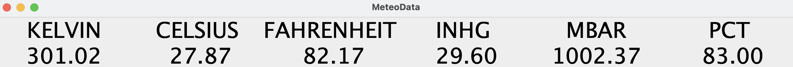

<!-- PROJECT -->
 
<h1 align="center">MeteoData</h3>

    

  
 

<!-- ABOUT -->
## About

MeteoData is a prototype Java application that creates and starts an independent thread to periodically read 
<b>temperature</b> (in `Kelvin`, `Celsius` and `Fahrenheit`), <b>pressure</b> (in `inHG` and `MBAR`) and <b>humidity</b> (in `PCT`) sensors, and prints / displays the retrieved values.

<!-- TECHNOLOGY -->
## Technology

* [![java][java]][java-url]

<!-- Team -->
## Team

See `/lib/team.txt` to see all team members of this project.
    
<!-- CONTACT -->
## Contact

[![linkedin][linkedin]][linkedin-url]
[![email][email]][email-url]

<!-- MARKDOWN LINKS & IMAGES -->
<!-- https://www.markdownguide.org/basic-syntax/#reference-style-links -->
[linkedin]: https://img.shields.io/badge/-LinkedIn-black.svg?style=for-the-badge&logo=linkedin&colorB=555
[linkedin-url]: https://www.linkedin.com/in/jurajstefanic/
[email]: https://img.shields.io/badge/email-555?style=for-the-badge&logo=gmail&logoColor=white
[email-url]: mailto:jurajstefanic@outlook.com
[java]: https://img.shields.io/badge/java-E34F26?style=for-the-badge&logo=&logoColor=white
[java-url]: https://www.java.com/